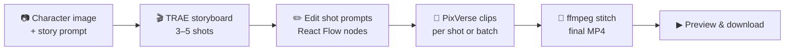
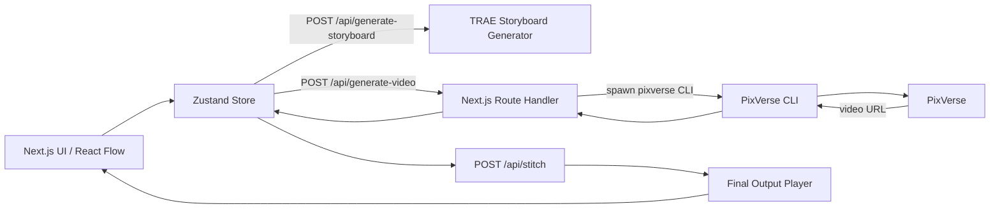

# VibeCine

**Turn a story + character image into a multi-shot video — with per-shot control, not one long prompt.**

[](https://intl.traedemo.com/en-US/works/22)
[](https://intl.traedemo.com/en-US/works/22)
[](https://nextjs.org/)
[](https://reactflow.dev/)
[](https://pixverse.ai/)

---

## 🏆 Award

> **1st Prize Winner — Demo Wall Popularity Track**  
> *Unbound Creativity with TRAE SOLO Vietnam 2026*  
> Issued by **Trae × MiniMax** · May 2026

VibeCine won **1st place** in the Demo Wall Popularity Track at **Unbound Creativity Vietnam 2026** for TRAE SOLO at the **TikTok Vietnam Office** in Ho Chi Minh City (The Nexus).

**Built by [Phan Quang Minh Long](https://www.linkedin.com/in/phanquangminhlong) & [Cường Mê AI](https://www.facebook.com/CuongMeAI)**

| | |
|---|---|
| **Demo Wall** | [intl.traedemo.com/en-US/works/22](https://intl.traedemo.com/en-US/works/22) |
| **Repository** | [github.com/trae-hackathon-solo/vibecine](https://github.com/trae-hackathon-solo/vibecine) |
| **Demo video** | [YouTube — full walkthrough](https://www.youtube.com/watch?v=2rFcfjQH7PM) |
| **Phan Quang Minh Long** | [LinkedIn](https://www.linkedin.com/in/phanquangminhlong) |
| **Cường Mê AI** | [Facebook](https://www.facebook.com/CuongMeAI) |

[](https://intl.traedemo.com/en-US/works/22)

---

## What is VibeCine?

VibeCine is a web app that turns a **story prompt** and a **character reference image** into a **short multi-shot video**. TRAE generates a storyboard of 3–5 shots; you edit each shot in visual node cards, generate clips with PixVerse (per shot or batch), preview inline, then **merge everything into one final MP4** via server-side ffmpeg.

Built in a tight hackathon window — no database, no auth, full end-to-end demo.

```
Story + character image  →  TRAE storyboard  →  PixVerse clips  →  ffmpeg merge  →  final MP4
```

### Why it exists

Single-prompt text-to-video is hard to steer:

- Shots feel **disconnected**
- Character **identity drifts** (face, outfit, lighting)
- Fixing one bad moment means **regenerating the whole video**

VibeCine fixes this with a **shot-based workflow**: reference image for identity, editable storyboard nodes, regenerate only the shots that fail, combine the rest into a final story. Iterate faster. Ship a judge-friendly demo.

---

## Demo

### Watch the full walkthrough

[](https://www.youtube.com/watch?v=2rFcfjQH7PM)

**[▶ Watch on YouTube](https://www.youtube.com/watch?v=2rFcfjQH7PM)**

### 60-second demo script

1. Upload a **character reference image**
2. Paste a **story prompt**
3. Click **Generate storyboard** — TRAE returns 3–5 editable shots
4. Tweak shot prompts (optional)
5. Click **Generate all videos** — one PixVerse clip per shot
6. Click **Combine final video** — ffmpeg merges clips into one **30s+ MP4**

---

## Workflow



| Step | What happens |
|------|--------------|
| **Inputs** | Character reference image (identity anchor) + high-level story prompt |
| **Storyboard** | TRAE generates shot list: title, scene description, editable video prompt |
| **Edit** | Each shot is a React Flow node — human-in-the-loop quality control |
| **Generate** | PixVerse creates one clip per shot; batch or individual regenerate |
| **Output** | Server-side ffmpeg merges completed clips into a single downloadable MP4 (≥ 30s) |

### Continuity trick

For shot *N*, we prepend shot *N−1* metadata (title, description, prompt) into shot *N*'s prompt string. This reduces character drift and disjointed transitions — without changing the underlying PixVerse call structure.

---

## Architecture



---

## How TRAE powered the build

Built under a **1–2 hour hackathon window**. TRAE shortened the loop from idea → runnable demo while keeping the workflow explainable to judges:

| Area | TRAE contribution |
|------|-------------------|
| **Product design** | Turned a rough idea into a shot-based workflow and data model |
| **Storyboard** | Story prompt → 3–5 shot list with PixVerse-friendly video prompts |
| **Prompt drafting** | Plain-language scene intent → camera, motion, lighting, mood |
| **Continuity** | Shot-chaining strategy to reduce character drift across clips |
| **Constraints** | Per-shot duration tuning so 3–5 shots reach ≥ 30s total |
| **Debugging** | Next.js App Router pitfalls, CLI spawn issues, JSON parsing quirks |
| **Integration** | Switched between PixVerse API vs CLI under time pressure; kept workflow coherent |

---

## Tech stack

| Layer | Choice |
|-------|--------|
| Framework | Next.js 15 (App Router), React 19, TypeScript |
| UI | TailwindCSS, HeroUI v2, React Flow, Framer Motion |
| State | Zustand |
| Video | PixVerse CLI / API, ffmpeg-static (server-side stitch) |
| Backend | None — no database, no auth, no external backend |

---

## Local setup

### Requirements

- **Node.js 20+**
- **PixVerse CLI** installed and authenticated

```bash
npm install -g pixverse
pixverse auth login
```

### Environment

Copy `.env.example` and add your PixVerse API key:

```bash
cp .env.example .env.local
```

### Run

```bash
npm install
npm run dev
```

Open [http://localhost:3000](http://localhost:3000)

---

## PixVerse integration

### CLI (recommended for hackathon)

Structured JSON output, easy to script:

```bash
pixverse auth login
pixverse auth status --json
```

Text-to-video:

```bash
pixverse create video \
  --prompt "A sunset over ocean waves" \
  --model v6 --quality 1080p --aspect-ratio 16:9 \
  --duration 8 --audio --json
```

Image-to-video:

```bash
pixverse create video \
  --prompt "Slow zoom in, cinematic lighting" \
  --image ./character.png \
  --duration 10 --json
```

### Platform API (optional)

Upload image → generate → poll status → get URL. The MVP primarily uses CLI for speed and reliability during demos.

---

## Key files

| File | Purpose |
|------|---------|
| `src/app/page.tsx` | React Flow workspace |
| `src/store/useAppStore.ts` | Global state |
| `src/components/SceneNode.tsx` | Per-shot node UI |
| `src/components/OutputNode.tsx` | Final output player + stitch trigger |
| `src/app/api/generate-storyboard/route.ts` | TRAE storyboard generation |
| `src/app/api/generate-video/route.ts` | PixVerse clip generation |
| `src/app/api/stitch/route.ts` | ffmpeg merge to final MP4 |

---

## Hackathon war stories

Real issues we hit — and fixed — during the build:

1. **Next.js `createContext` error** — moved providers into a dedicated client `Providers` component
2. **PixVerse API insufficient balance** — switched to CLI account credits
3. **Windows `spawn EINVAL`** — run PixVerse through `cmd.exe` correctly
4. **CLI JSON parsing** — robust extraction from mixed stdout/stderr with ANSI stripping

These failures became part of the demo narrative — and made the final build more robust.

---

## Links

- **Demo Wall:** [intl.traedemo.com/en-US/works/22](https://intl.traedemo.com/en-US/works/22)
- **YouTube demo:** [youtube.com/watch?v=2rFcfjQH7PM](https://www.youtube.com/watch?v=2rFcfjQH7PM)
- **Project summary:** [PROJECT_INFORMATION.md](./PROJECT_INFORMATION.md)
- **Phan Quang Minh Long:** [linkedin.com/in/phanquangminhlong](https://www.linkedin.com/in/phanquangminhlong)
- **Cường Mê AI:** [facebook.com/CuongMeAI](https://www.facebook.com/CuongMeAI)

---

<p align="center">
  <strong>🏆 1st Prize — Demo Wall Popularity Track</strong><br/>
  <em>Unbound Creativity with TRAE SOLO Vietnam 2026 · Trae × MiniMax</em><br/><br/>
  Built by <a href="https://www.linkedin.com/in/phanquangminhlong">Phan Quang Minh Long</a> &amp; <a href="https://www.facebook.com/CuongMeAI">Cường Mê AI</a>
</p>
